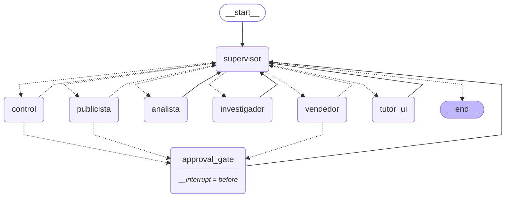

# Arquitectura del Grafo LangGraph - Tiendita IA

```mermaid
---
config:
  flowchart:
    curve: linear
---
graph TD;
	__start__([<p>__start__</p>]):::first
	supervisor(supervisor)
	control(control)
	vendedor(vendedor)
	analista(analista)
	investigador(investigador)
	publicista(publicista)
	tutor_ui(tutor_ui)
	approval_gate(approval_gate<hr/><small><em>__interrupt = before</em></small>)
	__end__([<p>__end__</p>]):::last
	__start__ --> supervisor;
	analista --> supervisor;
	approval_gate --> supervisor;
	control -.-> approval_gate;
	control -.-> supervisor;
	investigador --> supervisor;
	publicista -.-> approval_gate;
	publicista -.-> supervisor;
	supervisor -.-> __end__;
	supervisor -.-> analista;
	supervisor -.-> control;
	supervisor -.-> investigador;
	supervisor -.-> publicista;
	supervisor -.-> tutor_ui;
	supervisor -.-> vendedor;
	tutor_ui --> supervisor;
	vendedor -.-> approval_gate;
	vendedor -.-> supervisor;
	classDef default fill:#f2f0ff,line-height:1.2
	classDef first fill-opacity:0
	classDef last fill:#bfb6fc

```
